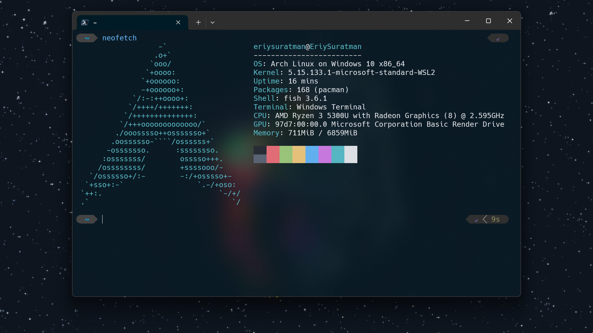

# **Belajar Fish Shell**

Dalam artikel ini, saya akan memberikan panduan langkah demi langkah dalam menggunakan Fish Shell, mulai dari pengertian hingga tips and tricks.


Fish Shell adalah sebuah shell interaktif yang dirancang untuk digunakan pada sistem operasi Linux dan Unix.

## **Fitur Fish Shell**

- **Extensive UI**: Fish Shell memiliki antarmuka yang luas karena terdapat kelebihan berikut:

  - Syntax Highlighting
  - Auto Suggestion
  - Tab Completion
  - Selection List

- **No configuration needed**: Fish dirancang agar dapat langsung digunakan, tanpa memerlukan konfigurasi ektensif.

- **Easy Scripting**: Fish memudahkan untuk menambahkan fungsi-fungsi dengan cepat. Serta sintaks yang mudah dipelajari dan digunakan.

## **Instalasi Fish Shell**

### **MacOS**

**Homebrew**

```bash
brew install fish
```

**MacPorts**

```bash
sudo port install fish
```

### **Linux**

**Debian**

Dokumentasi resmi untuk beberapa versi debian dapat dibaca [disini](https://software.opensuse.org/download.html?project=shells%3Afish%3Arelease%3A3&package=fish)

```bash
> echo 'deb http://download.opensuse.org/repositories/shells:/fish:/release:/3/Debian_12/ /' | sudo tee /etc/apt/sources.list.d/shells:fish:release:3.list
> curl -fsSL https://download.opensuse.org/repositories/shells:fish:release:3/Debian_12/Release.key | gpg --dearmor | sudo tee /etc/apt/trusted.gpg.d/shells_fish_release_3.gpg > /dev/null
> sudo apt update
> sudo apt install fish
```

**Ubuntu**

```bash
sudo apt-add-repository ppa:fish-shell/release-3
sudo apt update
sudo apt install fish
```

**Arch**

```bash
pacman -S fish
```

**Homebrew**

```bash
brew install fish
```

### **BSD**

**FreeBSD**

```bash
pkg install fish
```

**NetBSD**

```bash
pkgin install fish
```

**OpenBSD**

```bash
pkg_add fish
```

### **Windows**

**[Cygwin](https://cygwin.com/)**

**[Windows Subsystem for Linux](https://docs.microsoft.com/en-us/windows/wsl/install-win10)**

**MYSYS2**

```bash
pacman -S fish
```

### **Source**

**[fish-3.6.1.tar.xz](https://github.com/fish-shell/fish-shell/releases/download/3.6.1/fish-3.6.1.tar.xz)**

```bash
cmake .; make; sudo make install
```

**[Git Master](https://github.com/fish-shell/fish-shell/)**

```bash
git clone https://github.com/fish-shell/fish-shell.git
cd fish-shell; cmake .; make; sudo make install
```

| Dokumentasi lengkap instalasi Fish Shell dapat dibaca [disini](https://fishshell.com/)

## Cara menggunakan Fish

Saat pertama kali menginstal fish maka tidak secara langsung menjadi _default shell_ :

- Ketik `fish` untuk memulai Fish Shell:

```bash
> fish
Welcome to fish, the friendly interactive shell
Type help for instructions on how to use fish
you@hostname ~>
```

- Ketik `exit` untuk keluar dari Fish Shell:

```bash
> exit
```

## Cara mengganti Default Shell

Pada umumnya pada sistem operasi berbasis Linux & Unix menggunakan Bash Shell sebagai default shell.

Perintah berikut untuk mengganti default shell menjadi fish:

1. Tambahkan Fish Shell ke `/etc/shells` menggunakan perintah berikut:

   ```bash
   echo /usr/local/bin/fish | sudo tee -a /etc/shells
   ```

2. Mengganti default shell:
   ```bash
   chsh -s /usr/local/bin/fish
   ```

Jalankan perintah berikut untuk mengetahui versi fish:

```bash
> fish --version
fish, version 3.6.1
```

## Cara menghapus Fish Shell

Pastikan Fish Shell tidak sedang digunakan. Jalankan `chsh -s /bin/bash` untuk memastikan.

Jika menggunakan package manager maka gunakan fungsi untuk dari setiap package manager untuk menghapus fish seperti berikut:

**APT**

```bash
sudo apt remove fish
```

**Pacman**

```bash
sudo pacman -R fish
```

**Brew**

```bash
brew uninstall fish
```
